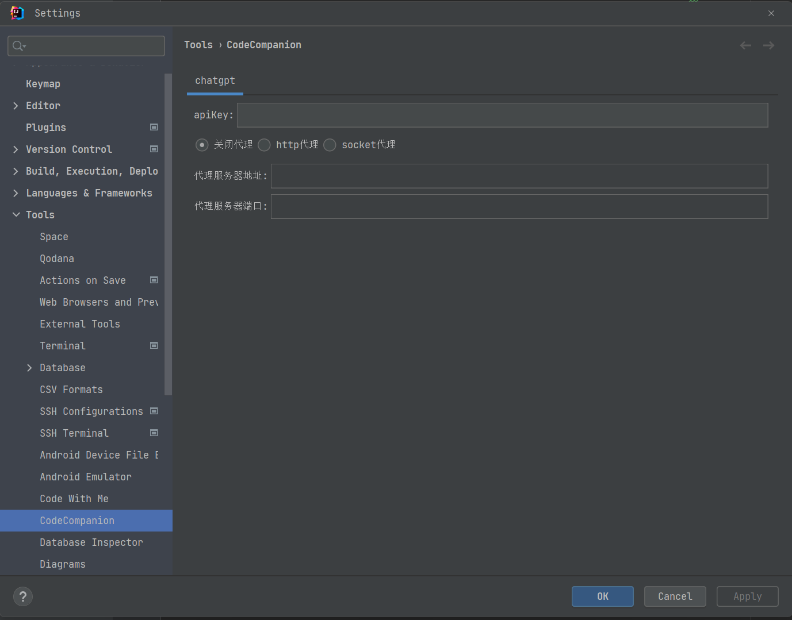
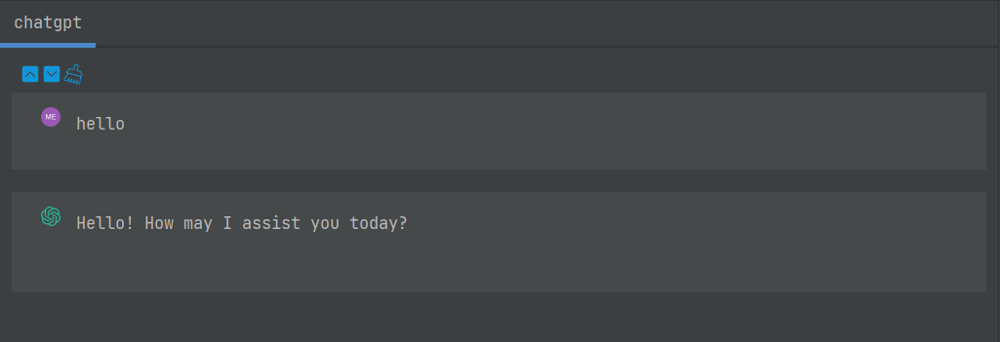

# CodeCompanion -- 代码伴侣

&emsp;&emsp;CodeCompanion主要提供在日常开发工作中，常用的idea 插件。目的是让工作更加高效，更加方便。 
&emsp;&emsp;目前版本提供了chatgpt的插件，方便大家使用。

## 1. 插件的安装

&emsp;&emsp;未来打算提供两种方式:
> 1. github下载jar，本地安装。可在github release页面下载安装。
>2. idea 插件市场 -- 待上传。

## 2. chagpt的使用

&emsp;&emsp;安装插件成功之后，插件默认出现在idea的右侧工具栏区域。 
&emsp;&emsp;同时可以在idea 的`Setting` -> `Tools` -> `CodeCompanion`，找到插件的配置页面。如下图:

&emsp;&emsp;在这里，可以配置apiKey，以及代理服务器。 
&emsp;&emsp;如果想要正常使用chatgpt，apiKey是必须要配置的。本插件不提供apiKey,需要自己在openai自行申请key，申请
过程可参考[官方文档](https://platform.openai.com/docs/api-reference) 
&emsp;&emsp;同时，在国内访问chatgpt的接口，一般需要上网工具。所以一般来说，还需要配置代理服务器。如果使用的是本地的工具，
可将代理服务器设置为本地。不同的工具采用的协议和端口可能不一样，我使用的v2rayN软件，如下配置仅供参考。
> 1. 代理服务器地址:127.0.0.1
> 2. 端口和代理类型: 可在工具查看
>
&emsp;&emsp;上述配置完成之后，就可以开心的使用chatgpt了。 如下图：
